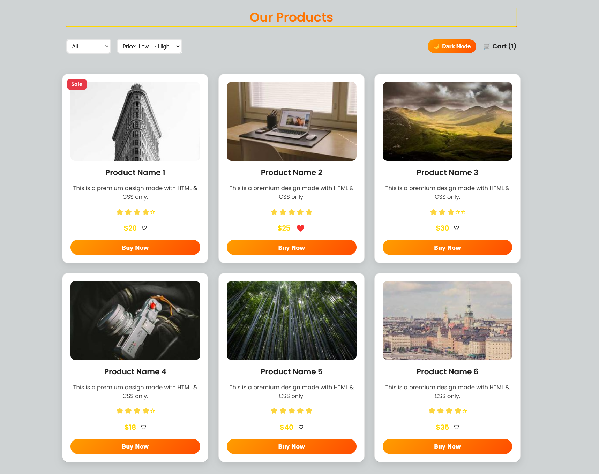
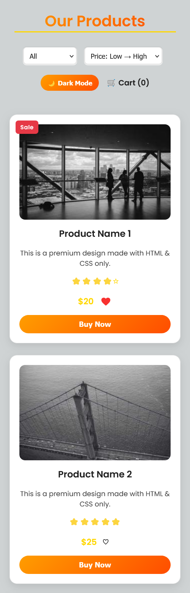

# 🛍️ Responsive Product Card Grid

A **modern, professional product grid UI** built with **HTML, CSS & JavaScript**.  
It features **dark mode, filtering, sorting, cart integration, favoriting system, and skeleton loaders** — all in a fully responsive layout.

---

## ✨ Features

### 🎨 UI & Design
- **Glassmorphism-inspired Cards** with smooth shadows & gradients  
- **Dark/Light Mode Toggle** with theme persistence  
- **Responsive Grid Layout**  
  - Desktop → 3–4 cards per row  
  - Tablet → 2 cards per row  
  - Mobile → 1 card per row  
- **Hover Animations** with scale + shadow  
- **Sale Badge** for promotional products  
- **Product Rating Stars** (ARIA-labeled for accessibility)  
- **Loading Skeletons** for images  

### ⚙️ Functionality
- **Filter Products** by price (below/above $30)  
- **Sort Products** by price (ascending/descending)  
- **Cart Integration** with live cart count 🛒  
- **Favoriting System** ❤️ / ♡ toggle  
- **Lazy-Loaded Images** for better performance  

### ♿ Accessibility
- Alt attributes on all product images  
- ARIA labels for ratings  
- Visible focus states for keyboard navigation  
- High contrast colors for text & background  

### 🚀 Performance Optimizations
- `loading="lazy"` for images  
- `will-change` for smoother animations  
- Preloaded critical CSS  
- Optimized gradient backgrounds  

---

## 🖼️ Preview

### Desktop


### Mobile


---

## 📂 Project Structure
```bash
.
├── index.html        # Main HTML file
├── style.css         # Stylesheet (with CSS variables & dark mode)
├── script.js         # JavaScript for interactivity
├── ScreenShoots/     # Screenshots for README
└── README.md         # Project documentation


🛠️ Technology Stack

HTML5
CSS3 (variables, grid, flexbox, transitions)
Vanilla JavaScript (ES6)
Google Fonts (Poppins)